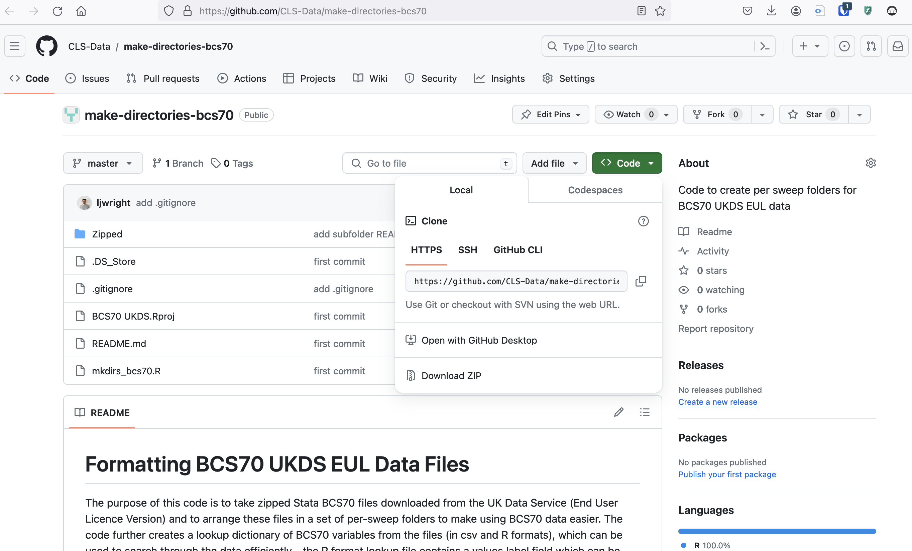
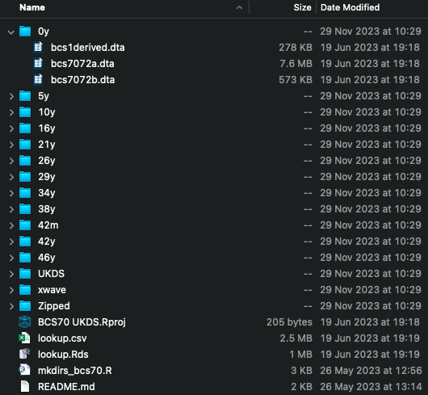

This page introduces code for taking [BCS70 UKDS End User Licence](https://doi.org/10.5255/UKDA-Series-200001) zipped Stata (`.dta`) files, unzipping them and placing into per-sweep folders. The code is available on GitHub: [https://github.com/CLS-Data/make-directories-bcs70](https://github.com/CLS-Data/make-directories-bcs70).

To use the code, first download or clone the GitHub directory. To download the directory, on the GitHub website, click `Code -> Download ZIP` (see screenshot below) then unzip the downloaded file and place in a suitable location on your computer. To clone the directory, open your computer's command line or terminal, navigate to an appropriate location (`cd ...`) and type `git clone https://github.com/CLS-Data/make-directories-bcs70`. You may want to rename the folder from `make-directories-bcs70` to `BCS70` or something similar.

When the folder is downloaded, open the `README.md` file and follow the instructions. You will need to download `R` and `RStudio`, as well as the appropriate BCS70 Stata files off the UK Data Service. The `README.md` file lists the asset numbers of the files the code will work for.

Once completed, the folder should look like the below. You will see the code also creates a data dictionary (in `.csv` and `R` [`.Rdata`] formats) which you can use to search for variables. 

