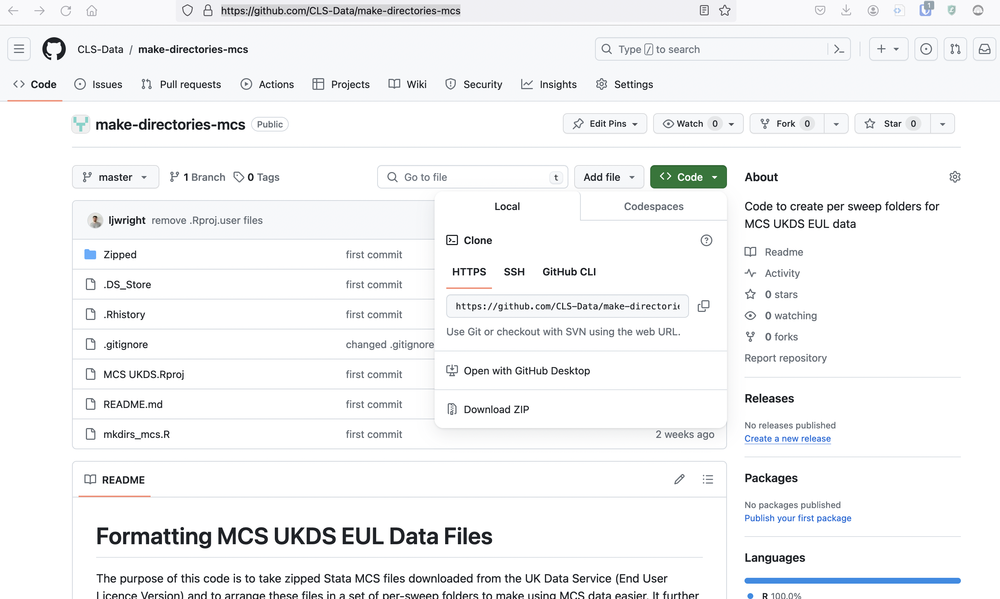
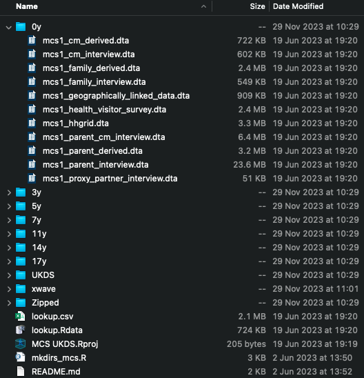

This page introduces code for taking [MCS UKDS End User Licence](https://doi.org/10.5255/UKDA-Series-2000031) zipped Stata (`.dta`) files, unzipping them and placing into per-sweep folders. The code is available on GitHub: [https://github.com/CLS-Data/make-directories-mcs](https://github.com/CLS-Data/make-directories-mcs).

To use the code, first download or clone the GitHub directory. 
* To download the directory, on the GitHub website, click `Code -> Download ZIP` (see screenshot below) then unzip the downloaded file and place it in a suitable location on your computer. 
* To clone the directory, open your computer's command line or terminal, navigate to an appropriate location (`cd ...`) and type `git clone https://github.com/CLS-Data/make-directories-mcs`. You may want to rename the folder from `make-directories-mcs` to `MCS` or something similar.

When the folder is downloaded, open the `README.md` file and follow the instructions therein. You will need to download `R` and `RStudio`, as well as the appropriate MCS Stata (`.dta`) files from the UK Data Service. The `README.md` file lists the UKDS asset numbers of the files the code will work for.

Once completed, the folder should look like the below. You will see the code also creates a data dictionary (in `.csv` and `R` [`.Rdata`] formats). You can use this to efficiently search for variables. 

